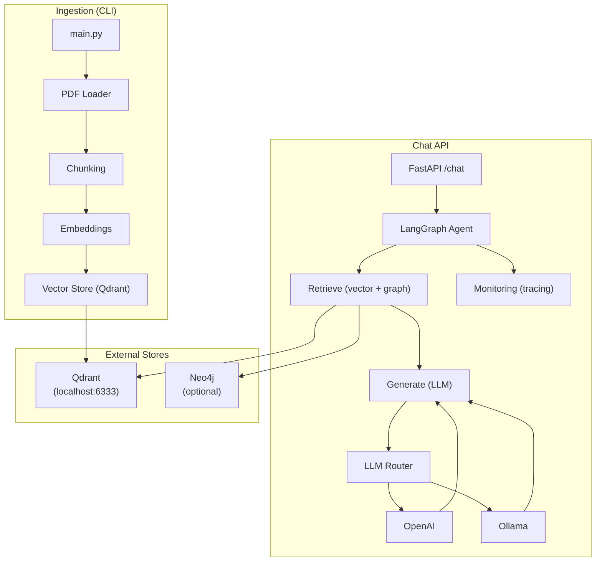
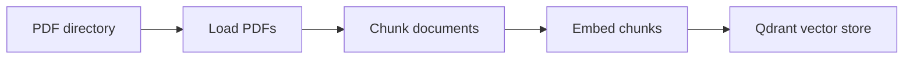
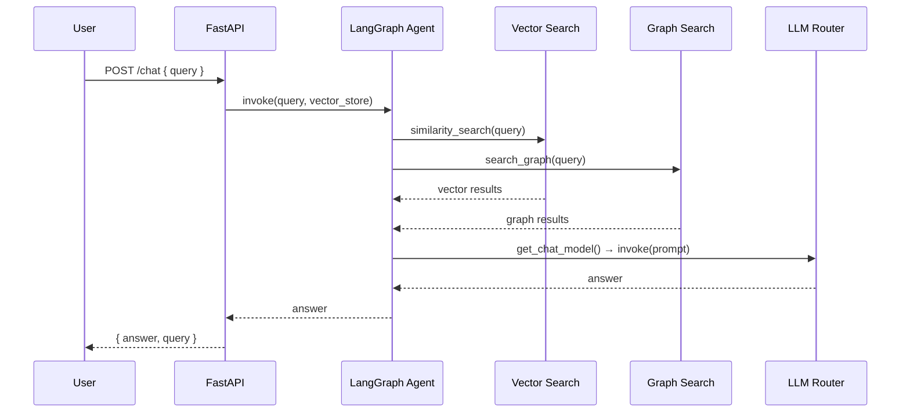

# GenAI RAG Platform

A GenAI RAG platform with **PDF ingestion**, **vector search** (Qdrant), **graph search** (Neo4j), and a **LangGraph-based chat API**. Supports **OpenAI** or **Ollama** (local) as the LLM. No Docker required—run Qdrant and Neo4j natively.

---

## Table of contents

- [Design & architecture](#design--architecture)
- [Prerequisites](#prerequisites)
- [Setup](#setup)
- [Running services](#running-services)
- [How to run](#how-to-run)
- [Configuration](#configuration)
- [Makefile](#makefile)
- [Project layout](#project-layout)
- [License](#license)

---

## Design & architecture

### High-level components



### Ingestion pipeline

PDFs in a directory are loaded, split into chunks, embedded, and stored in Qdrant.



### Chat request flow

A chat request is answered using hybrid retrieval (vector + graph) and the configured LLM.



---

## Prerequisites

- **Python 3.10+**
- **Poetry** (recommended) or pip + venv
- **Qdrant** — vector store (required). Run locally on `http://localhost:6333`
- **Neo4j** — optional; used for graph search (chat skips gracefully if unavailable)

---

## Setup

1. **Clone the repository**

   ```bash
   git clone https://github.com/VenkySami/genai-rag-platform.git
   cd genai-platform
   ```

2. **Install dependencies**

   ```bash
   make install
   ```

3. **Configure environment**

   ```bash
   cp .env.example .env
   ```

4. **Prepare PDFs**  
   Place PDFs in a directory (e.g. `data/pdfs/`). The ingestion command takes the **directory path**, not a single file.

---

## Running services

| Service | Purpose | How to run |
|--------|---------|------------|
| **Qdrant** | Vector store | [Releases](https://github.com/qdrant/qdrant/releases) — run so it listens on `http://localhost:6333` |
| **Neo4j** (optional) | Graph search | [Neo4j Community](https://neo4j.com/download/) — `bin/neo4j start` |

---

## How to run

### 1. Ingest PDFs into the vector store

Ensure Qdrant is running, then:

```bash
make run-ingestion
# or: poetry run python main.py data/pdfs
```

To use a different PDF directory:

```bash
poetry run python main.py /path/to/your/pdfs
# or: make run-ingestion PDF_DIR=/path/to/pdfs
```

### 2. Start the chat API

```bash
make run-api
```

API runs at `http://0.0.0.0:8000`. Example request:

```bash
curl -X POST http://localhost:8000/chat -H "Content-Type: application/json" -d '{"query": "Your question here"}'
```

---

## Makefile

| Target | Description |
|--------|-------------|
| `make install` | Install dependencies (Poetry) and run Ruff lint. |
| `make run-ingestion` | Ingest PDFs from `data/pdfs` into Qdrant (override with `PDF_DIR=...`). |
| `make run-api` | Start the FastAPI chat server on port 8000. 

---

## Project layout

| Path | Description |
|------|-------------|
| `main.py` | CLI entry: `parse_args()`, `run_ingestion()`. Accepts a **PDF directory** path. |
| `api/` | FastAPI app; `POST /chat` invokes the LangGraph agent. |
| `app/` | Core app: ingestion (PDF, chunking, embeddings), vector DB (Qdrant), graph DB (Neo4j), agents (LangGraph), retrieval (hybrid). |
| `llm/` | LLM router (OpenAI/Ollama) and central prompt templates. |
| `monitoring/` | Tracing for LLM calls (latency, model, prompt preview). |
| `pyproject.toml` | Poetry config (package-mode = false), Ruff & Mypy. |
| `.env.example` | Example env vars; copy to `.env`. |

---

## License

MIT License. See [LICENSE](LICENSE).
